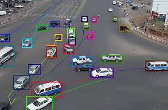

# 🎯 Object Tracking Application


A powerful and user-friendly web application for tracking moving objects in videos using computer vision techniques. Built with Python, OpenCV, and Streamlit.


## 📋 Overview

This application uses advanced background subtraction algorithms to detect and track moving objects in video files. It provides real-time visualization, customizable detection parameters, and comprehensive statistics about detected objects.

## ✨ Features

### Core Functionality
- **Real-time Object Detection**: Tracks moving objects using MOG2 background subtraction
- **Bounding Box Visualization**: Draws boxes around detected objects with area labels
- **Multiple Video Format Support**: MP4, AVI, MOV, WMV, MKV

### User Interface
- **Professional GUI**: Clean, intuitive interface with custom styling
- **Wide Layout**: Optimized for viewing videos and statistics
- **Responsive Design**: Adapts to different screen sizes

### Customization Options
- **Detection Parameters**:
  - Adjustable minimum object area (100-2000 pixels)
  - Background learning rate control (0.001-0.1)
- **Display Options**:
  - Custom bounding box colors
  - Adjustable box thickness (1-5 pixels)
  - Toggle detection mask view
  - Real-time statistics display
- **Playback Controls**:
  - Variable playback speed (0.25x to 2.0x)

### Analytics & Statistics
- **Video Information**: Resolution, FPS, frame count, duration
- **Real-time Metrics**:
  - Current frame number
  - Objects detected in current frame
  - Total detections across video
  - Processing FPS
- **Processing Summary**:
  - Total frames processed
  - Total detections
  - Maximum objects in a single frame
  - Average detections per frame

### Advanced Features
- **Noise Reduction**: Morphological operations to filter false detections
- **Shadow Detection**: Built-in shadow detection in background subtraction
- **Progress Tracking**: Visual progress bar with percentage completion
- **Side-by-side View**: Optional mask visualization alongside original video

## 🚀 Installation

### Prerequisites
- Python 3.7 or higher
- pip package manager

### Setup Instructions

1. **Clone or download this repository**
```bash
cd object_tracking_app
```

2. **Install required dependencies**
```bash
pip install -r requirements.txt
```

If `requirements.txt` doesn't exist, install manually:
```bash
pip install streamlit opencv-python-headless numpy
```

## 💻 Usage

### Running the Application

1. **Start the Streamlit server**
```bash
streamlit run app.py
```

2. **Open your web browser**
   - The application will automatically open at `http://localhost:8501`
   - If it doesn't open automatically, navigate to the URL shown in the terminal

### Using the Application

1. **Upload a Video**
   - Click the "Upload your video file" button
   - Select a video file (MP4, AVI, MOV, WMV, or MKV)

2. **Adjust Settings (Optional)**
   - Open the sidebar to customize detection parameters
   - Adjust minimum object area to filter small movements
   - Modify learning rate based on your video characteristics
   - Change bounding box color and thickness
   - Toggle detection mask view

3. **Process Video**
   - The video will automatically start processing after upload
   - Watch real-time detection with bounding boxes
   - Monitor statistics in the dashboard

4. **Review Results**
   - After processing completes, view the comprehensive summary
   - Analyze total detections and average objects per frame

## 🎛️ Parameter Guide

### Minimum Object Area
- **Range**: 100-2000 pixels
- **Default**: 300 pixels
- **Purpose**: Filters out small noise and focuses on larger objects
- **Recommendation**: 
  - Increase for large objects (vehicles, people)
  - Decrease for small objects (small animals, objects)

### Background Learning Rate
- **Range**: 0.001-0.1
- **Default**: 0.01
- **Purpose**: Controls how quickly the background model adapts
- **Recommendation**:
  - Higher values (0.05-0.1): Dynamic backgrounds, changing lighting
  - Lower values (0.001-0.02): Static backgrounds, stable lighting

### Playback Speed
- **Options**: 0.25x, 0.5x, 0.75x, 1.0x, 1.5x, 2.0x
- **Default**: 1.0x
- **Purpose**: Control processing speed for better visualization

## 📁 Project Structure

```
object_tracking_app/
│
├── app.py              # Main application file
├── README.md           # Project documentation
└── requirements.txt    # Python dependencies (optional)
```

## 🔧 Technical Details

### Algorithm
- **Background Subtraction**: MOG2 (Mixture of Gaussians)
- **Contour Detection**: External contours with simple approximation
- **Noise Reduction**: Morphological opening and closing operations
- **Shadow Detection**: Enabled in MOG2 algorithm

### Libraries Used
- **Streamlit**: Web application framework
- **OpenCV (cv2)**: Computer vision operations
- **NumPy**: Numerical operations
- **tempfile**: Temporary file handling
- **datetime**: Timestamp operations

## 💡 Tips for Best Results

1. **Video Quality**
   - Use videos with relatively static backgrounds
   - Ensure good lighting conditions
   - Avoid excessive camera shake

2. **Parameter Tuning**
   - Start with default values
   - Adjust minimum area based on object size
   - Increase learning rate for outdoor videos with changing light
   - Decrease learning rate for controlled indoor environments

3. **Performance**
   - Larger videos may take longer to process
   - Adjust playback speed if processing is slow
   - Close other applications for better performance

## 🐛 Troubleshooting

### Video Won't Load
- **Solution**: Ensure the video format is supported (MP4, AVI, MOV, WMV, MKV)
- **Solution**: Try re-encoding the video with standard codecs

### Too Many False Detections
- **Solution**: Increase the minimum object area
- **Solution**: Decrease the background learning rate

### Missing Detections
- **Solution**: Decrease the minimum object area
- **Solution**: Increase the background learning rate

### Slow Processing
- **Solution**: Use a smaller resolution video
- **Solution**: Close unnecessary applications
- **Solution**: Increase playback speed parameter

## 📝 License

This project is open source and available for educational and personal use.

## 🤝 Contributing

Contributions, issues, and feature requests are welcome! Feel free to improve the application.

## 📧 Contact

For questions or feedback, please open an issue in the repository.

## 🙏 Acknowledgments

- OpenCV community for computer vision algorithms
- Streamlit team for the amazing web framework
- Background subtraction research community

---

**Made with ❤️ using Python, OpenCV, and Streamlit**
